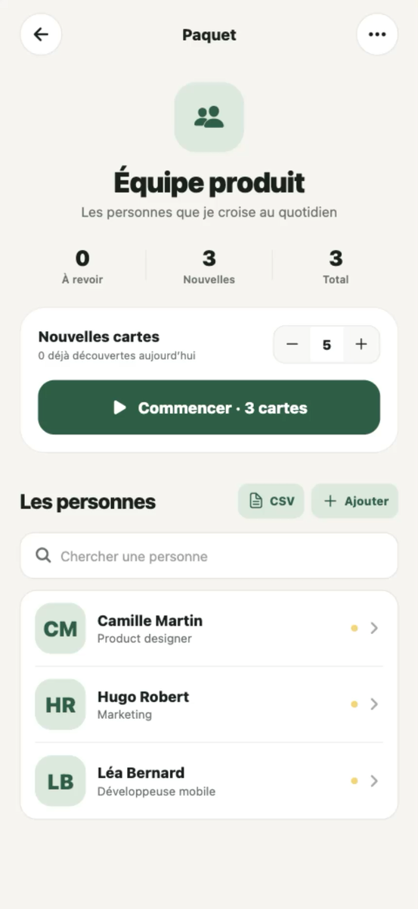
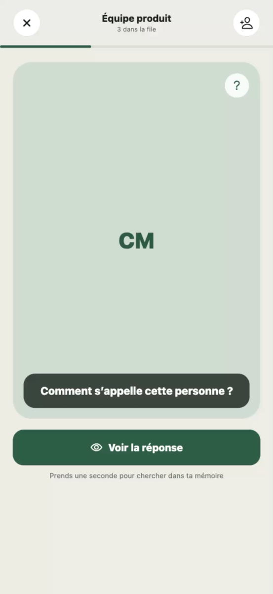

# Mémento

**Retenez enfin les prénoms des personnes que vous croisez.**

Mémento transforme les visages de votre équipe, de votre classe ou de votre association en courtes sessions de mémorisation. Ajoutez une photo, un prénom et un peu de contexte : l’application vous propose ensuite les bonnes personnes à revoir au bon moment.

<p align="center">
  
  &nbsp;
  
  &nbsp;
  
</p>

## À qui s’adresse Mémento ?

- aux personnes qui rejoignent une nouvelle équipe ;
- aux enseignants et élèves d’une classe ;
- aux membres d’une association ou d’un club ;
- à toutes celles et ceux qui reconnaissent un visage… mais oublient le prénom.

## Comment ça marche ?

1. **Créez un groupe**, par exemple « Équipe produit » ou « Club de théâtre ».
2. **Ajoutez les personnes** une par une, ou importez-les depuis un fichier CSV ou ZIP.
3. **Lancez une courte session** et essayez de retrouver chaque prénom à partir de la photo.
4. **Choisissez quand revoir la personne** selon votre niveau de certitude.

Mémento espace automatiquement les révisions. Vous pouvez adapter leur rythme et limiter le nombre de nouvelles personnes découvertes chaque jour.

## Ce que vous pouvez faire

- mémoriser un prénom à partir d’une photo ;
- ajouter un nom et un contexte pour mieux situer la personne ;
- organiser vos contacts en plusieurs groupes ;
- rechercher et modifier facilement une fiche ;
- importer ou mettre à jour de nombreuses personnes en une fois ;
- personnaliser les délais de révision ;
- continuer à utiliser l’application sans compte et sans connexion.

## Vos données restent sur votre appareil

Les photos, les groupes et la progression sont enregistrés localement. Mémento ne nécessite pas de compte et n’envoie pas votre carnet de personnes vers un service distant.

Pensez à conserver votre fichier d’import d’origine : la version actuelle ne propose pas encore de sauvegarde synchronisée entre plusieurs appareils.

## Installation

### Android

Téléchargez la dernière version depuis la page des [versions de Mémento](https://github.com/hamon-e/flashcard/releases/latest), puis ouvrez le fichier APK sur votre téléphone.

Android peut demander l’autorisation d’installer une application provenant de votre navigateur ou de votre gestionnaire de fichiers.

### iPhone et développement

Il n’existe pas encore de version distribuée sur l’App Store. Pour essayer Mémento depuis le code source, consultez la section destinée aux contributeurs ci-dessous.

<details>
<summary><strong>Importer plusieurs personnes avec un fichier</strong></summary>

Mémento accepte les fichiers CSV séparés par des virgules ou des points-virgules. Seule la colonne `prenom` est obligatoire.

```csv
prenom,nom,photo,contexte,id_externe
Alice,Martin,https://example.com/alice.jpg,Design,alice-001
```

La colonne `photo` peut contenir une adresse web publique. Vous pouvez aussi sélectionner une archive ZIP contenant le CSV et les portraits. La colonne `id_externe` permet de mettre à jour une personne lors d’un prochain import sans perdre sa progression.

Les noms de colonnes anglais (`firstname`, `lastname`, `context`, `external_id`) sont également reconnus. Le fichier [`example.csv`](./example.csv) peut servir de modèle.

</details>

<details>
<summary><strong>Lancer le projet depuis le code source</strong></summary>

Le projet utilise Expo SDK 57. Après avoir installé Node.js :

```bash
npm install
npm start
```

Scannez le QR code avec Expo Go, ou appuyez sur `i`, `a` ou `w` pour ouvrir respectivement les versions iOS, Android ou web.

</details>

## Licence

Mémento est distribué sous [licence MIT](./LICENSE).
